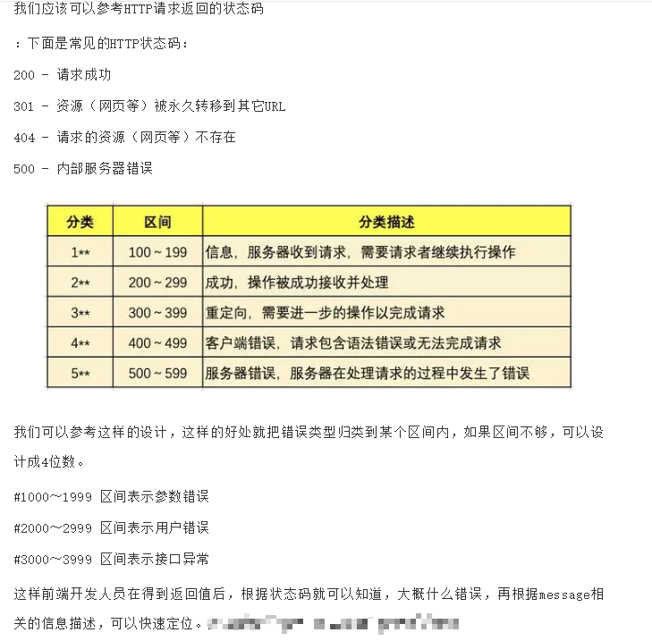

## 2019-12-18
`ES6` 数组 map\reduce\filter\forEach 的使用
## 2019-12-17
复习 `java io nio`文件等使用
## 2019-12-10
`restful` 风格接口设计 
https://mp.weixin.qq.com/s/0QtcK2wJNLOENJDq6646fA

内容:`com.example.studyResultfulAPI`

## 2019-12-02
- `MyBatis` 枚举自定义类型使用
## 2019-11-28
- `MyBatis` 枚举类型使用
- `POI`读取与写入 `EXCEL`工具的使用 参考文章: https://www.cnblogs.com/Dreamer-1/p/10469430.html
## 2019-11-26
- `jackson` 使用  
## 2019-11-23
- 加入 `sfl4j` + `logback` 日志框架
## 2019-11-21
- 复习`MyBatis`一对多级联查询
## 2019-11-20 
- 重新学习了下 `MyBatis`
## 2019-11-18
- 添加了简单文件上传模块
## 2019-11-15
- 在左侧导航栏中添加了简单登录模块